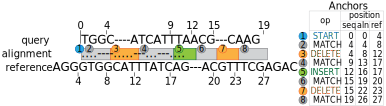

Alignment representation
========================

```@meta
CurrentModule = BioAlignments
DocTestSetup = quote
    using BioSequences
    using BioAlignments
end
```

Overview
--------

Types related to alignment representation introduced in this chapter are
indispensable concepts to use this package. Specifically, `Alignment`,
`AlignmentAnchor` and `Operation` are the most fundamental types of this
package to represent an alignment of two sequences.


Representing alignments
-----------------------

The `Alignment` type can represent a wide variety of global or local sequence
alignments while facilitating efficient coordinate transformation.  Alignments
are always relative to a possibly unspecified reference sequence and represent a
series of [edit operations](https://en.wikipedia.org/wiki/Edit_distance)
performed on that reference to transform it to the query sequence. An edit
operation is, for example, matching, insertion, or deletion.  All operations
defined in BioAlignments.jl are described in the [Alignment operations](@ref)
section.

To represent an alignment we use a series of "anchors" stored in the
`AlignmentAnchor` type. Anchors are form of run-length encoding alignment
operations, but rather than store an operation along with a length, we store the
end-point of that operation in both reference and query coordinates.

```julia
struct AlignmentAnchor
    seqpos::Int
    refpos::Int
    op::Operation
end
```

The next figure shows a schematic representation of an alignment object.



Every alignment starts with a special `OP_START` operation which is used to give
the position in the reference and query prior to the start of the alignment, or
0, if the alignment starts at position 1.

For example, consider the following alignment:

                  0   4        9  12 15     19
                  |   |        |  |  |      |
        query:     TGGC----ATCATTTAACG---CAAG
    reference: AGGGTGGCATTTATCAG---ACGTTTCGAGAC
                  |   |   |    |     |  |   |
                  4   8   12   17    20 23  27

Using anchors we would represent this as the following series of anchors:
```julia
[
    AlignmentAnchor( 0,  4, OP_START),
    AlignmentAnchor( 4,  8, OP_MATCH),
    AlignmentAnchor( 4, 12, OP_DELETE),
    AlignmentAnchor( 9, 17, OP_MATCH),
    AlignmentAnchor(12, 17, OP_INSERT),
    AlignmentAnchor(15, 20, OP_MATCH),
    AlignmentAnchor(15, 23, OP_DELETE),
    AlignmentAnchor(19, 27, OP_MATCH),
]
```

An `Alignment` object can be created from a series of anchors:
```jldoctest
julia> Alignment([
           AlignmentAnchor(0,  4, OP_START),
           AlignmentAnchor(4,  8, OP_MATCH),
           AlignmentAnchor(4, 12, OP_DELETE)
       ])
Alignment:
  aligned range:
    seq: 0-4
    ref: 4-12
  CIGAR string: 4M4D
```


Alignment operations
--------------------

Alignment operations follow closely from those used in the [SAM/BAM
format](https://samtools.github.io/hts-specs/SAMv1.pdf) and are stored in the
`Operation` bitstype.

| Operation            | Operation Type     | Description                                                                     |
| :------------------- | :----------------- | :------------------------------------------------------------------------------ |
| `OP_MATCH`           | match              | non-specific match                                                              |
| `OP_INSERT`          | insert             | insertion into reference sequence                                               |
| `OP_DELETE`          | delete             | deletion from reference sequence                                                |
| `OP_SKIP`            | delete             | (typically long) deletion from the reference, e.g. due to RNA splicing          |
| `OP_SOFT_CLIP`       | insert             | sequence removed from the beginning or end of the query sequence but stored     |
| `OP_HARD_CLIP`       | insert             | sequence removed from the beginning or end of the query sequence and not stored |
| `OP_PAD`             | special            | not currently supported, but present for SAM/BAM compatibility                  |
| `OP_SEQ_MATCH`       | match              | match operation with matching sequence positions                                |
| `OP_SEQ_MISMATCH`    | match              | match operation with mismatching sequence positions                             |
| `OP_BACK`            | special            | not currently supported, but present for SAM/BAM compatibility                  |
| `OP_START`           | special            | indicate the start of an alignment within the reference and query sequence      |

Each operation has its own one-letter representation, which is the same as those
defined in the SAM file format.

```jldoctest
julia> convert(Operation, 'M')  # Char => Operation
OP_MATCH

julia> convert(Char, OP_MATCH)  # Operation => Char
'M': ASCII/Unicode U+004d (category Lu: Letter, uppercase)

julia> ismatchop(OP_MATCH)
true

```

See the [Operations](@ref) section in the references for more details.


Aligned sequences
-----------------

A sequence aligned to another sequence is represented by the `AlignedSequence`
type, which is a pair of the aligned sequence and an `Alignment` object.

The following example creates an aligned sequence object from a sequence and an
alignment:
```jldoctest
julia> AlignedSequence(  # pass an Alignment object
           dna"ACGTAT",
           Alignment([
               AlignmentAnchor(0, 0, OP_START),
               AlignmentAnchor(3, 3, OP_MATCH),
               AlignmentAnchor(6, 3, OP_INSERT)
           ])
       )
···---
ACGTAT

julia> AlignedSequence(  # or pass a vector of anchors
           dna"ACGTAT",
           [
               AlignmentAnchor(0, 0, OP_START),
               AlignmentAnchor(3, 3, OP_MATCH),
               AlignmentAnchor(6, 3, OP_INSERT)
           ]
       )
···---
ACGTAT

```

If you already have an aligned sequence with gap symbols, it can be converted to
an `AlignedSequence` object by passing a reference sequence with it:
```jlcon
julia> seq = dna"ACGT--AAT--"
11nt DNA Sequence:
ACGT--AAT--

julia> ref = dna"ACGTTTAT-GG"
11nt DNA Sequence:
ACGTTTAT-GG

julia> AlignedSequence(seq, ref)
········-··
ACGT--AAT--

```
